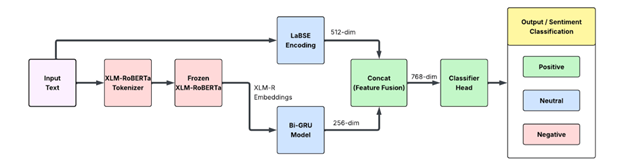
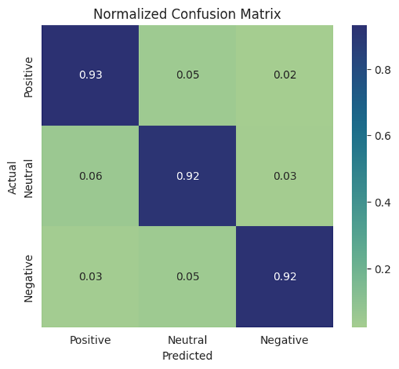
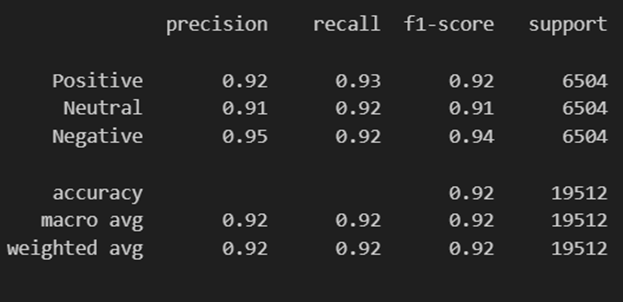

# Multilingual Sentiment Analysis for Indian Languages

## 1. Overview

This project implements a **multilingual sentiment analysis model** that classifies text into:

- Positive  
- Neutral  
- Negative  

across **12 languages (11 Indian languages + English)**.

The model uses a **hybrid architecture** combining:
- Contextual embeddings (XLM-R)
- Sequence modeling (BiGRU)
- Sentence embeddings (LaBSE)

---

## 2. Model Pipeline

  


---

## 3. Key Components

### a. XLM-RoBERTa
- Multilingual transformer (100+ languages)
- Provides contextual token embeddings
- Used as a frozen feature extractor

### b. BiGRU
- Captures sequential dependencies
- Improves contextual understanding

### c. LaBSE
- Sentence-level embedding model
- Strong cross-lingual alignment

### d. Fusion Layer
- Combines local (GRU) + global (LaBSE) features

---

## 4. Dataset

- **Languages:** 12  
- **Samples:** ~130K+  
- **Classes:** Positive / Neutral / Negative  
- **Domains:** Reviews, social media, surveys  

> Dataset sourced from Hugging Face (CC BY-NC 4.0)

---

## 5. Training Details

- Batch Size: 32  
- Epochs: 5  
- Optimizer: Adam  
- Learning Rate: 2e-4  
- Loss Function: CrossEntropyLoss  

---

## 6. Results

- Accuracy: **~92%** 
- Evaluated using:
  - Accuracy
  - F1-score
  - Confusion Matrix

### Confusion Matrix

 

### Classification Report

 

---

## 7. How to Run

### a. Install dependencies

```bash
pip install torch transformers sentence-transformers pandas seaborn
```

### b. Open Notebook

Run the notebook:
```
FusionModel.ipynb
```

### c. Train + Evaluate

The notebook includes:

- Data loading
- Preprocessing
- Model training
- Evaluation
- Visualization

## 8. Features of this project
- Multilingual support 
- Hybrid embedding model
- Efficient training 
- Works across multiple domains

## 9. Future Work
- Fine-tune XLM-R/ Extend training
- Add language-wise evaluation
- Cross test with benchmark datasets (IndicSentiment)
- Extend to emotion classification
- Adapt to code-mixing
